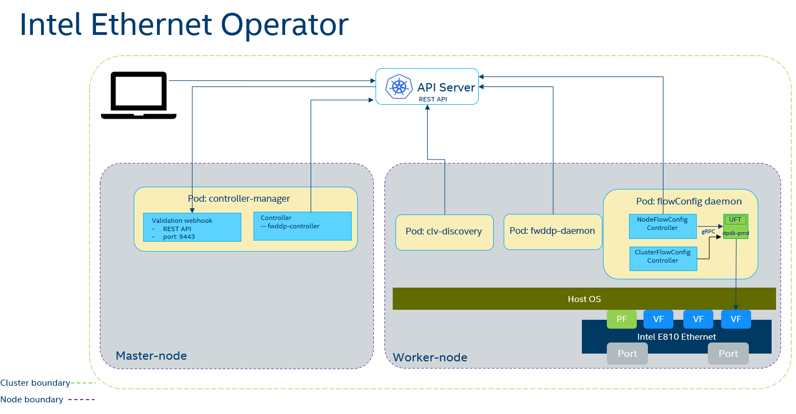

```text
SPDX-License-Identifier: Apache-2.0
Copyright (c) 2021 Intel Corporation
```
<!-- omit in toc -->
# Intel Ethernet Operator documentation

- [Overview](#overview)
- [Intel Ethernet Operator](#intel-ethernet-operator)
  - [Intel Ethernet Operator - Controller-Manager](#intel-ethernet-operator---controller-manager)
  - [Intel Ethernet Operator - Device Discovery](#intel-ethernet-operator---device-discovery)
  - [Intel Ethernet Operator - FW/DDP Daemon](#intel-ethernet-operator---fwddp-daemon)
    - [Firmware Update (FW) Functionality](#firmware-update-fw-functionality)
    - [Dynamic Device Personalization (DDP) Functionality](#dynamic-device-personalization-ddp-functionality)
  - [Intel Ethernet Operator - Flow Configuration](#intel-ethernet-operator---flow-configuration)
    - [Node Flow Configuration Controller](#node-flow-configuration-controller)
    - [Unified Flow Tool](#unified-flow-tool)
  - [Prerequisites](#prerequisites)
    - [Intel Ethernet Operator - SRIOV](#intel-ethernet-operator---sriov)
    - [Intel Ethernet Operator - OOT ICE driver update](#intel-ethernet-operator---oot-ice-driver-update)
- [Technical Requirements and Dependencies](#technical-requirements-and-dependencies)
- [Deploying the Operator](#deploying-the-operator)
  - [Installing the dependencies](#installing-the-dependencies)
  - [Build the Operator from source](#build-the-operator-from-source)
  - [Installing the Bundle](#installing-the-bundle)
  - [Applying custom resources](#applying-custom-resources)
    - [Updating Firmware](#updating-firmware)
    - [Updating DDP](#updating-ddp)
    - [Deploy Flow Configuration agent](#deploy-flow-configuration-agent)
      - [Creating Trusted VF using SRIOV Network Operator](#creating-trusted-vf-using-sriov-network-operator)
      - [Check node status](#check-node-status)
      - [Create DCF capable SRIOV Network](#create-dcf-capable-sriov-network)
      - [Build UFT image](#build-uft-image)
      - [Create FlowConfig Node Agent deployment CR](#create-flowconfig-node-agent-deployment-cr)
      - [Verify that FlowConfig Daemon is running on available nodes:](#verify-that-flowconfig-daemon-is-running-on-available-nodes)
      - [Creating Flow Configuration rules with Intel Ethernet Operator](#creating-flow-configuration-rules-with-intel-ethernet-operator)
      - [Update a sample Node Flow Configuration rule](#update-a-sample-node-flow-configuration-rule)
- [Hardware Validation Environment](#hardware-validation-environment)
- [Summary](#summary)

## Overview

This document provides the instructions for using the Intel Ethernet Operator in Red Hat's OpenShift Container Platform. This operator was developed with aid of the Operator SDK project.

## Intel Ethernet Operator

> Note: This operator is not ready for production environment.

The role of the Intel Ethernet Operator is to orchestrate and manage the configuration of the capabilities exposed by the Intel E810 Series network interface cards (NICs). The operator is a state machine which will configure certain functions of the card and then monitor the status and act autonomously based on the user interaction.
The operator design of the Intel Ethernet Operator supports the following E810 series cards:

- [Intel® Ethernet Network Adapter E810-CQDA1/CQDA2](https://cdrdv2.intel.com/v1/dl/getContent/641671?explicitVersion=true)
- [Intel® Ethernet Network Adapter E810-XXVDA4](https://cdrdv2.intel.com/v1/dl/getContent/641676?explicitVersion=true)
- [Intel® Ethernet Network Adapter E810-XXVDA2](https://cdrdv2.intel.com/v1/dl/getContent/641674?explicitVersion=true)

The Intel Ethernet Operator provides functionality for:

- Update of the devices' FW (Firmware) via [NVM Update tool](https://www.intel.com.au/content/www/au/en/support/articles/000088453/ethernet-products.html).
- Update of the devices' DDP ([Dynamic Device Personalization](https://www.intel.com/content/www/us/en/architecture-and-technology/ethernet/dynamic-device-personalization-brief.html)) profile.
- Flow configuration of traffic handling for the devices, based on supported DDP profile.

Upon deployment the operator provides APIs, Controllers and Daemons responsible for management and execution of the supported features. A number of dependencies (ICE driver, SRIOV Network Operator, NFD) must be fulfilled before the deployment of this operator - these dependencies are listed in the [prerequisites section](#prerequisites). The user interacts with the operator by providing CRs (CustomResources). The operator constantly monitors the state of the CRs to detect any changes and acts based on the changes detected. There is a separate CR to be provided for the FW/DDP update functionality and the Flow Configuration functionality. Once the CR is applied or updated, the operator/daemon checks if the configuration is already applied and if it is not, it applies the configuration.



### Intel Ethernet Operator - Controller-Manager

The controller manager pod is the first pod of the operator, it is responsible for deployment of other assets, exposing the APIs, handling of the CRs and executing the validation webhook. It contains the logic for accepting and splitting the FW/DDP CRs into node CRs and reconciling the status of each CR.

The validation webhook of the controller manager is responsible for checking each CR for invalid arguments.

### Intel Ethernet Operator - Device Discovery

The CLV-discovery pod is a DaemonSet deployed on each worker node in the cluster. It's responsibility is to check if a supported hardware is discovered on the platform and label the node accordingly.

To get all the nodes containing the supported devices run:

```shell
oc get EthernetNodeConfig -A

NAMESPACE                 NAME       UPDATE
intel-ethernet-operator   worker-1   InProgress
intel-ethernet-operator   worker-2   InProgress
```

To get the list of supported devices to be found by the discovery pod run:

```shell
oc describe configmap supported-clv-devices -n intel-ethernet-operator
```

### Intel Ethernet Operator - FW/DDP Daemon

The FW/DDP daemon pod is a DaemonSet deployed as part of the operator. It is deployed on each node labeled with appropriate label indicating that a supported E810 Series NIC is detected on the platform. It is a reconcile loop which monitors the changes in each node's `EthernetNodeConfig` and acts on the changes. The logic implemented into this Daemon takes care of updating the cards' NIC firmware and DDP profile. It is also responsible for draining the nodes, taking them out of commission and rebooting when required by the update.

#### Firmware Update (FW) Functionality

Once the operator/daemon detects a change to a CR related to the update of the Intel® E810 NIC firmware, it tries to perform an update. The firmware for the Intel® E810 NICs is expected to be provided by the user in form of a `tar.gz` file. The user is also responsible to verify that the firmware version is compatible with the device. The user is required to place the firmware on an accessible HTTP server and provide an URL for it in the CR. If the file is provided correctly and the firmware is to be updated, the Ethernet Configuration Daemon will update the Intel® E810 NICs with the NVM utility provided.

To update the NVM firmware of the Intel® E810 cards' NICs user must create a CR containing the information about which card should be programmed. The Physical Functions of the NICs will be updated in logical pairs. The user needs to provide the FW URL and checksum (md5) in the CR.

For a sample CR go to [Updating Firmware](#updating-firmware).

#### Dynamic Device Personalization (DDP) Functionality

Once the operator/daemon detects a change to a CR related to the update of the Intel® E810 DDP profile, it tries to perform an update. The DDP profile for the Intel® E810 NICs is expected to be provided by the user. The user is also responsible to verify that the DDP version is compatible with the device. The user is required to place the DDP package on an accessible HTTP server and provide an URL for it in the CR. If the file is provided correctly and the DDP is to be updated, the Ethernet Configuration Daemon will update the DDP profile of Intel® E810 NICs by placing it in correct filesystem on the host.

To update the DDP profile of the Intel® E810 NIC user must create a CR containing the information about which card should be programmed. All the Physical Functions of the NICs will be updated for each NIC.

For a sample CR go to [Updating DDP](#updating-ddp).

### Intel Ethernet Operator - Flow Configuration


The Flow Configuration pod is a DaemonSet deployed with a CRD `FlowConfigNodeAgentDeployment` provided by Ethernet operator once it is up and running and the required DCF VF pools and their *`network attachement definitions`* are created with SRIOV Network Operator APIs. It is deployed on each node that exposes DCF VF pool as extended node resource. It is a reconcile loop which monitors the changes in each node's CR and acts on the changes. The logic implemented into this Daemon takes care of updating the cards' NIC traffic flow configuration. It consists of two components Flow Config controller container and UFT container.


#### Node Flow Configuration Controller

The Node Flow Configuration Controller watches for flow rules changes via a node specific CRD - `NodeFlowConfig` named same as the node name. Once the operator/daemon detects a change to this CR related to the Intel® E810 Flow Configuration, it tries to create/delete rules via UFT over an internal gPRC API call.

#### Unified Flow Tool

Once the Flow Config change is required the Flow Config Controller will communicate with the UFT container running a DPDK DCF application. The UFT application accepts an input with the configuration and programmes the device using a trusted VF created for this device (it is responsibility of the user to provide the trusted VFs as an allocatable K8s resource - see pre-requisites section).

### Prerequisites

The Intel Ethernet Operator has a number of prerequisites that must be met in order for complete operation of the Operator.

#### Intel Ethernet Operator - SRIOV

In order for the Flow Configuration feature to be able to configure the flow configuration of the NICs traffic the configuration must happen using a trusted VF from each PF in the NIC. Usually it is the VF0 of a PF that has the trust mode set to `on` and bound to `vfio-pci` driver. This VF pool needs to be created by the user and be allocatable as a K8s resource. This VF pool will be used exclusively by the UFT container and no application container.

For user applications additional VF pools should be created separately as needed.

One way of creating and providing this trusted VF and application VFs is to configure it through SRIOV Network Operator.
In OCP environments the SRIOV Network Operator will be deployed as a dependency to Intel Ethernet Operator automatically.
The configuration and creation of the trusted VFs and application is out of scope of this Operator and is users responsibility.

#### Intel Ethernet Operator - OOT ICE driver update

In order for the FW update and Flow Configuration to be possible the platform needs to provide an [OOT ICE driver](https://www.intel.com/content/www/us/en/download/19630/intel-network-adapter-driver-for-e810-series-devices-under-linux.html). This is required since current implementations of in-tree drivers do not support all required features.
It is a responsibility of the cluster admin to provide and install this driver and it is out of scope of this Operator at this time. See the [sro-ice-install document](oot-ice-driver/sro-ice-install.md) for sample instructions on how to install the driver using SRO.

## Technical Requirements and Dependencies

The Intel Ethernet Operator on OCP has the following requirements:

- Intel® Ethernet Network Adapter E810
- [OpenShift 4.9.7](https://docs.openshift.com/container-platform/4.9/release_notes/ocp-4-9-release-notes.html)
- [Intel® Network Adapter Driver for E810 Series Devices](https://www.intel.com/content/www/us/en/download/19630/intel-network-adapter-driver-for-e810-series-devices-under-linux.html)
- Node Feature Discovery Operator with basic NFD CR applied
- SRIOV Network Operator
- Docker registry

## Deploying the Operator

The Intel Ethernet Operator can be deployed by building the Bundle image and the Operator images from source. An external registry is necessary to push the images during build.

### Installing the dependencies

Before building and installing the operator provide and install the OOT Intel ICE driver to the platforms. The driver can be downloaded from [Intel Download Centre](https://www.intel.com/content/www/us/en/download/19630/intel-network-adapter-driver-for-e810-series-devices-under-linux.html). 

On OCP deployments the SRIOV Network operator will be deployed automatically as a dependency to Intel Ethernet Operator.

### Build the Operator from source

To build the Operator the images must be built from source, in order to build execute the following steps:

> Note: The arguments are to be replaced with the following:
>
> * VERSION is the version to be applied to the bundle ie. `0.0.1`.
> * IMAGE_REGISTRY is the address of the registry where the build images are to be pushed to ie. `my.private.registry.com`.
> * TLS_VERIFY defines whether connection to registry need TLS verification, default is `false`.

```shell
# cd intel-ethernet-operator
# make VERSION=$(VERSION) IMAGE_REGISTRY=$(IMAGE_REGISTRY) TLS_VERIFY=$(TLS_VERIFY) build_all push_all catalog-build catalog-push
```

### Installing the Bundle

Once the operator images are built and accessible inside the cluster the operator is to be installed by running the following:

Create a namespace for the operator:

```shell
# oc create ns intel-ethernet-operator
```

Create the following `Catalog Source` `yaml` file:

> Note: The REGISTRY_ADDRESS and VERSION need to be replaced:
>
> * VERSION is the version to be applied to the bundle ie. `0.0.1`.
> * IMAGE_REGISTRY is the address of the registry where the build images are to be pushed to ie. `my.private.registry.com`.

```yaml
apiVersion: operators.coreos.com/v1alpha1
kind: CatalogSource
metadata:
  name: intel-ethernet-operators
  namespace: openshift-marketplace
spec:
  sourceType: grpc
  image: <IMAGE_REGISTRY>/intel-ethernet-operator-catalog:<VERSION>                                                            
  publisher: Intel
  displayName: Intel ethernet operators(Local)
```

Create the `Catalog Source`

```shell
# oc apply -f <filename>
```

Create the following `yaml` files including `Subscription` and `OperatorGroup`:

```yaml
---
apiVersion: operators.coreos.com/v1
kind: OperatorGroup
metadata:
  name: intel-ethernet-operator
  namespace: intel-ethernet-operator
spec:
  targetNamespaces:
    - intel-ethernet-operator

---

apiVersion: operators.coreos.com/v1alpha1
kind: Subscription
metadata:
  name: intel-ethernet-subscription
  namespace: intel-ethernet-operator
spec:
  channel: alpha
  name: intel-ethernet-operator
  source: intel-ethernet-operators
  sourceNamespace: openshift-marketplace
```

Subscribe to and install the operator:

```shell
# oc apply -f <filename>
```

Check that the operator is deployed:
> Note: SRIOV Network Operator pods deployed as a dependency in OCP environments.

```oc get pods -n intel-ethernet-operator
NAME                                                          READY   STATUS    RESTARTS      AGE
clv-discovery-db6j7                                           1/1     Running   0             23h
clv-discovery-fl5n6                                           1/1     Running   0             23h
clv-discovery-pqhtl                                           1/1     Running   0             23h
fwddp-daemon-4cmn7                                            1/1     Running   0             23h
fwddp-daemon-5jjzw                                            1/1     Running   0             23h
intel-ethernet-operator-controller-manager-75d4449bfb-cx65b   1/1     Running   0             23h
intel-ethernet-operator-controller-manager-75d4449bfb-dhqv5   1/1     Running   0             23h
network-resources-injector-g27j2                              1/1     Running   0             23h
network-resources-injector-kddh4                              1/1     Running   0             23h
network-resources-injector-vqhqk                              1/1     Running   0             23h
operator-webhook-5gbz8                                        1/1     Running   0             23h
operator-webhook-c42n6                                        1/1     Running   0             23h
operator-webhook-rtt7v                                        1/1     Running   0             23h
sriov-network-config-daemon-6xdlg                             3/3     Running   0             23h
sriov-network-config-daemon-gp9xz                             3/3     Running   0             23h
sriov-network-config-daemon-sqgck                             3/3     Running   0             23h
sriov-network-operator-78cf54b79d-ll9nz                       1/1     Running   0             45h
```

### Applying custom resources

Once the operator is successfully deployed, the user interacts with it by creating CRs which will be interpreted by the operator.

#### Updating Firmware

To find the NIC devices belonging to the Intel® E810 NIC run following command, the user can detect the device information of the NICs from the output:

```shell
# oc get enc <nodename> -o jsonpath={.status}
```

To update the Firmware of the supported device run following steps:

>Note: The Physical Functions of the NICs will be updated in logical pairs. The user needs to provide the FW URL and checksum (md5).

Create a CR `yaml` file:

```yaml
apiVersion: ethernet.intel.com/v1
kind: EthernetClusterConfig
metadata:
  name: config
  namespace: <namespace>
spec:
  nodeSelectors:
    kubernetes.io/hostname: <hostname>
  deviceSelector:
    pciAddress: "<pci-address>"
  deviceConfig:
    fwURL: "<URL_to_firmware>"
    fwChecksum: "<file_checksum_md5_hash>"
```

The CR can be applied by running:

```shell
# oc apply -f <filename>
```

Once the NVM firmware update is complete, the following status is reported:

```shell
# oc get enc <nodename> -o jsonpath={.status.conditions}
[
  {
    "lastTransitionTime": "2021-12-17T15:25:32Z",
    "message": "Updated successfully",
    "observedGeneration": 3,
    "reason": "Succeeded",
    "status": "True",
    "type": "Updated"
  }
]
```

The user can observe the change of the cards' NICs firmware:

```shell
# oc get enc <nodename> -o jsonpath={.status.devices[0].firmware}
{
  "MAC": "40:a6:b7:67:1f:c0",
  "version": "3.00 0x80008271 1.2992.0"
}
```

#### Updating DDP

To update the DDP profile of the supported device run following steps:

Create a CR `yaml` file:

```yaml
apiVersion: ethernet.intel.com/v1
kind: EthernetClusterConfig
metadata:
  name: <name>
  namespace: <namespace>
spec:
  nodeSelectors:
    kubernetes.io/hostname: <hostname>
  deviceSelector:
    pciAddress: "<pci-address>"
  deviceConfig: 
    ddpURL: "<URL_to_DDP>"
    ddpChecksum: "<file_checksum_md5_hash>"
```

The CR can be applied by running:

```shell
# oc apply -f <filename>
```

Once the DDP profile update is complete, the following status is reported:

```shell
# oc get enc <nodename> -o jsonpath={.status.conditions}
[
  {
  "lastTransitionTime": "2021-12-17T15:25:32Z",
  "message": "Updated successfully",
  "observedGeneration": 3,
  "reason": "Succeeded",
  "status": "True",
  "type": "Updated"
  }
]
```

The user can observe the change of the cards' NICs DDP:

```shell
# oc get enc <nodename> -o jsonpath={.status.devices[0].DDP}|jq
{
  "packageName": "ICE COMMS Package",
  "trackId": "0xc0000002",
  "version": "1.3.30.0"
}
```

#### Deploy Flow Configuration agent

To update the Flow Configuration of the supported device a trusted VF for this device needs to be created first. Once the trusted VF is created the VFs to be used by the applications and to be programmed with appropriate config also need to be created. Once these are in place the Operator can configure the Flow Configuration.

##### Creating Trusted VF using SRIOV Network Operator

Once SRIOV Network operator is up and running we can examine the `SriovNetworkNodeStates` to view available Intel E810 Series NICs as shown below:

```shell
# oc get sriovnetworknodestates -n intel-ethernet-operator
NAME              AGE
worker-01   1d


# oc describe sriovnetworknodestates worker-01 -n intel-ethernet-operator
Name:         worker-01                                                         
Namespace:    intel-ethernet-operator                                                 
Labels:       <none>                                                                  
Annotations:  <none>                                                                  
API Version:  sriovnetwork.openshift.io/v1                                            
Kind:         SriovNetworkNodeState                                                   
Metadata:                                                                                                  
Spec:                                                                                 
  Dp Config Version:  42872603                                                        
Status:                                                                               
  Interfaces:                                                                         
    Device ID:      165f                                                              
    Driver:         tg3                                                               
    Link Speed:     100 Mb/s                                                          
    Link Type:      ETH                                                               
    Mac:            b0:7b:25:de:3f:be                                                 
    Mtu:            1500                                                              
    Name:           eno8303                                                           
    Pci Address:    0000:04:00.0                                                      
    Vendor:         14e4                                                              
    Device ID:      165f                                                              
    Driver:         tg3                                                               
    Link Speed:     -1 Mb/s                                                           
    Link Type:      ETH                                                               
    Mac:            b0:7b:25:de:3f:bf                                                 
    Mtu:            1500                                                              
    Name:           eno8403                                                           
    Pci Address:    0000:04:00.1                                                      
    Vendor:         14e4                                                              
    Device ID:      159b                                                              
    Driver:         ice
    Link Speed:     -1 Mb/s
    Link Type:      ETH
    Mac:            b4:96:91:cd:de:38
    Mtu:            1500
    Name:           eno12399
    Pci Address:    0000:31:00.0
    Vendor:         8086
    Device ID:      159b
    Driver:         ice
    Link Speed:     -1 Mb/s
    Link Type:      ETH
    Mac:            b4:96:91:cd:de:39
    Mtu:            1500
    Name:           eno12409
    Pci Address:    0000:31:00.1
    Vendor:         8086
    Device ID:      1592
    Driver:         ice
    E Switch Mode:  legacy
    Link Speed:     -1 Mb/s
    Link Type:      ETH
    Mac:            b4:96:91:aa:d8:40
    Mtu:            1500
    Name:           ens1f0
    Pci Address:    0000:18:00.0
    Totalvfs:       128
    Vendor:         8086
    Device ID:      1592
    Driver:         ice
    E Switch Mode:  legacy
    Link Speed:     -1 Mb/s
    Link Type:      ETH
    Mac:            b4:96:91:aa:d8:41
    Mtu:            1500
    Name:           ens1f1
    Pci Address:    0000:18:00.1
    Totalvfs:       128
    Vendor:         8086
  Sync Status:      Succeeded
Events:             <none>

```

By looking at the sriovnetworknodestates status we can find the NIC information such as PCI address and Interface names to define `SriovNetworkNodePolicy` to create required VF pools.

For example, the following three `SriovNetworkNodePolicy` CRs will create a trusted VF pool name with resourceName `cvl_uft_admin` along with two additional VF pools for application:

```yaml
apiVersion: sriovnetwork.openshift.io/v1
kind: SriovNetworkNodePolicy
metadata:
  name: uft-admin-policy
spec:
  deviceType: vfio-pci
  nicSelector:
    pfNames:
    - ens1f0#0-0
    - ens1f1#0-0
    vendor: "8086"
  nodeSelector:
    feature.node.kubernetes.io/network-sriov.capable: 'true'
  numVfs: 8
  priority: 99
  resourceName: cvl_uft_admin
---
apiVersion: sriovnetwork.openshift.io/v1
kind: SriovNetworkNodePolicy
metadata:
  name: cvl-vfio-policy
spec:
  deviceType: vfio-pci
  nicSelector:
    pfNames:
    - ens1f0#1-3
    - ens1f1#1-3
    vendor: "8086"
  nodeSelector:
    feature.node.kubernetes.io/network-sriov.capable: 'true'
  numVfs: 8
  priority: 89
  resourceName: cvl_vfio
---
apiVersion: sriovnetwork.openshift.io/v1
kind: SriovNetworkNodePolicy
metadata:
  name: cvl-iavf-policy
spec:
  deviceType: netdevice
  nicSelector:
    pfNames:
    - ens1f0#4-7
    - ens1f1#4-7
    vendor: "8086"
  nodeSelector:
    feature.node.kubernetes.io/network-sriov.capable: 'true'
  numVfs: 8
  priority: 79
  resourceName: cvl_iavf

```

Save the above yaml in file name `sriov-network-policy.yaml` and then apply this to create the VF pools.

The CR can be applied by running:

```shell
# oc create -f sriov-network-policy.yaml
```

##### Check node status 

Check node status to confirm that cvl_uft_admin resource pool registered DCF capable VFs of the node

```shell
# oc describe node worker-01 -n intel-ethernet-operator | grep -i allocatable -A 20
Allocatable:
  bridge.network.kubevirt.io/cni-podman0:  1k
  cpu:                                     108
  devices.kubevirt.io/kvm:                 1k
  devices.kubevirt.io/tun:                 1k
  devices.kubevirt.io/vhost-net:           1k
  ephemeral-storage:                       468315972Ki
  hugepages-1Gi:                           0
  hugepages-2Mi:                           8Gi
  memory:                                  518146752Ki
  openshift.io/cvl_iavf:                   8
  openshift.io/cvl_uft_admin:              2
  openshift.io/cvl_vfio:                   6
  pods:                                    250
```


##### Create DCF capable SRIOV Network

Next, we will need to create SRIOV network attachment definition for the DCF VF pool as shown below:

```shell
cat <<EOF | oc apply -f -
apiVersion: sriovnetwork.openshift.io/v1
kind: SriovNetwork
metadata:
  name: sriov-cvl-dcf
spec:
  trust: 'on'
  networkNamespace: intel-ethernet-operator
  resourceName: cvl_uft_admin
EOF
```


##### Build UFT image

```shell
# export IMAGE_REGISTRY=<OCP Image registry>
# export IEO_SRC_DIR=<This repo source directory location>

# git clone https://github.com/intel/UFT.git

## Apply UFT patch
# git apply $IEO_SRC_DIR/patches/uft-dockerfile-and-entrypoint.patch

# make dcf-image

# docker tag dcf-tool:v21.08 $IMAGE_REGISTRY/dcf-tool:v21.08

# docker push $IMAGE_REGISTRY/dcf-tool:v21.08

```

##### Create FlowConfig Node Agent deployment CR

```shell
cat <<EOF | oc apply -f -
apiVersion: flowconfig.intel.com/v1
kind: FlowConfigNodeAgentDeployment
metadata:
  labels:
    control-plane: flowconfig-daemon
  name: flowconfig-daemon-deployment
  namespace: intel-ethernet-operator
spec:
  DCFVfPoolName: openshift.io/cvl_uft_admin
  NADAnnotation: sriov-cvl-dcf
EOF
```

##### Verify that FlowConfig Daemon is running on available nodes:

```shell
# oc get pods -n intel-ethernet-operator
NAME                                                          READY   STATUS    RESTARTS   AGE
clv-discovery-kwjkb                                           1/1     Running   0          44h
clv-discovery-tpqzb                                           1/1     Running   0          44h
flowconfig-daemon-worker-01                                   2/2     Running   0          44h
fwddp-daemon-m8d4w                                            1/1     Running   0          44h
intel-ethernet-operator-controller-manager-79c4d5bf6d-bjlr5   1/1     Running   0          44h
intel-ethernet-operator-controller-manager-79c4d5bf6d-txj5q   1/1     Running   0          44h

# oc logs -n intel-ethernet-operator flowconfig-daemon-worker-01 -c uft
Generating server_conf.yaml file...                                              
Done!                                                                            
server :                                                                         
    ld_lib : "/usr/local/lib64"                                                  
ports_info :                                                                     
    - pci  : "0000:18:01.0"                                                      
      mode : dcf                                                                 
do eal init ...                                                                  
[{'pci': '0000:18:01.0', 'mode': 'dcf'}]                                         
[{'pci': '0000:18:01.0', 'mode': 'dcf'}]                                         
the dcf cmd line is: a.out -c 0x30 -n 4 -a 0000:18:01.0,cap=dcf -d /usr/local/lib64 --file-prefix=dcf --
EAL: Detected 96 lcore(s)                                                                               
EAL: Detected 2 NUMA nodes                                                                              
EAL: Detected shared linkage of DPDK                                                                    
EAL: Multi-process socket /var/run/dpdk/dcf/mp_socket                                                   
EAL: Selected IOVA mode 'VA'                                                                            
EAL: No available 1048576 kB hugepages reported                                                         
EAL: VFIO support initialized                                                                           
EAL: Using IOMMU type 1 (Type 1)                                                                        
EAL: Probe PCI driver: net_iavf (8086:1889) device: 0000:18:01.0 (socket 0)                             
EAL: Releasing PCI mapped resource for 0000:18:01.0                                                     
EAL: Calling pci_unmap_resource for 0000:18:01.0 at 0x2101000000                                        
EAL: Calling pci_unmap_resource for 0000:18:01.0 at 0x2101020000                                        
EAL: Using IOMMU type 1 (Type 1)                                                                        
EAL: Probe PCI driver: net_ice_dcf (8086:1889) device: 0000:18:01.0 (socket 0)                          
ice_load_pkg_type(): Active package is: 1.3.30.0, ICE COMMS Package (double VLAN mode)                  
TELEMETRY: No legacy callbacks, legacy socket not created                                               
grpc server start ...                                                                                   
now in server cycle                
```
##### Creating Flow Configuration rules with Intel Ethernet Operator

With trusted VFs and application VFs ready to be configured, program the Flow Configuration by running:

Create a sample Node specific NodeFlowConfig CR named same as a target node with empty spec:

```shell
cat <<EOF | oc apply -f -
apiVersion: flowconfig.intel.com/v1
kind: NodeFlowConfig
metadata:
  name: worker-01
spec:
EOF
```


Check status of CR:

```shell
# oc describe nodeflowconfig worker-01

Name:         worker-01
Namespace:    intel-ethernet-operator
Labels:       <none>
Annotations:  <none>
API Version:  flowconfig.intel.com/v1
Kind:         NodeFlowConfig
Metadata:
Status:
  Port Info:
    Port Id:    0
    Port Mode:  dcf
    Port Pci:   0000:18:01.0
Events:         <none>

```
You can see the DCF port information from NodeFlowConfig CR status for a node. These port information can be used to identify for which port on a node the Flow rules should be applied.


##### Update a sample Node Flow Configuration rule

Please see the [NodeFlowConfig Spec](flowconfig-daemon/creating-rules.md) for detailed specification of supported rules.
We can update the Node Flow configuration with a sample rule for a target port as shown below:

```shell
cat <<EOF | oc apply -f -
apiVersion: flowconfig.intel.com/v1
kind: NodeFlowConfig
metadata:
  name: worker-01
  namespace: intel-ethernet-operator
spec:
  rules:
    - pattern:
        - type: RTE_FLOW_ITEM_TYPE_ETH
        - type: RTE_FLOW_ITEM_TYPE_IPV4
          spec:
            hdr:
              src_addr: 10.56.217.9
          mask:
            hdr:
              src_addr: 255.255.255.255
        - type: RTE_FLOW_ITEM_TYPE_END
      action:
        - type: RTE_FLOW_ACTION_TYPE_DROP
        - type: RTE_FLOW_ACTION_TYPE_END
      portId: 0
      attr:
        ingress: 1
EOF
```

Validate that Flow Rules are applied by the controller from UFT logs.

```shell
oc logs flowconfig-daemon-worker uft
Generating server_conf.yaml file...
Done!
server :
    ld_lib : "/usr/local/lib64"
ports_info :
    - pci  : "0000:18:01.0"
      mode : dcf
do eal init ...
[{'pci': '0000:18:01.0', 'mode': 'dcf'}]
[{'pci': '0000:18:01.0', 'mode': 'dcf'}]
the dcf cmd line is: a.out -c 0x30 -n 4 -a 0000:18:01.0,cap=dcf -d /usr/local/lib64 --file-prefix=dcf --
EAL: Detected 96 lcore(s)
EAL: Detected 2 NUMA nodes
EAL: Detected shared linkage of DPDK
EAL: Multi-process socket /var/run/dpdk/dcf/mp_socket
EAL: Selected IOVA mode 'VA'
EAL: No available 1048576 kB hugepages reported
EAL: VFIO support initialized
EAL: Using IOMMU type 1 (Type 1)
EAL: Probe PCI driver: net_iavf (8086:1889) device: 0000:18:01.0 (socket 0)
EAL: Releasing PCI mapped resource for 0000:18:01.0
EAL: Calling pci_unmap_resource for 0000:18:01.0 at 0x2101000000
EAL: Calling pci_unmap_resource for 0000:18:01.0 at 0x2101020000
EAL: Using IOMMU type 1 (Type 1)
EAL: Probe PCI driver: net_ice_dcf (8086:1889) device: 0000:18:01.0 (socket 0)
ice_load_pkg_type(): Active package is: 1.3.30.0, ICE COMMS Package (double VLAN mode)
TELEMETRY: No legacy callbacks, legacy socket not created
grpc server start ...
now in server cycle
flow.rte_flow_attr
flow.rte_flow_item
flow.rte_flow_item
flow.rte_flow_item_ipv4
flow.rte_ipv4_hdr
flow.rte_flow_item_ipv4
flow.rte_ipv4_hdr
flow.rte_flow_item
flow.rte_flow_action
flow.rte_flow_action
rte_flow_attr(group=0, priority=0, ingress=1, egress=0, transfer=0, reserved=0) [rte_flow_item(type_=9, spec=None, last=None, mask=None), rte_flow_item(type_=11, spec=rte_flow_item_ipv4(hdr=rte_ipv4_hdr(version_ihl=0, type_of_service=0, total_length=0, packet_id=0, fragment_offset=0, time_to_live=0, next_proto_id=0, hdr_checksum=0, src_addr=171497737, dst_addr=0)), last=None, mask=rte_flow_item_ipv4(hdr=rte_ipv4_hdr(version_ihl=0, type_of_service=0, total_length=0, packet_id=0, fragment_offset=0, time_to_live=0, next_proto_id=0, hdr_checksum=0, src_addr=4294967295, dst_addr=0))), rte_flow_item(type_=0, spec=None, last=None, mask=None)] [rte_flow_action(type_=7, conf=None), rte_flow_action(type_=0, conf=None)]
rte_flow_attr(group=0, priority=0, ingress=1, egress=0, transfer=0, reserved=0)
1
Finish ipv4: {'hdr': {'version_ihl': 0, 'type_of_service': 0, 'total_length': 0, 'packet_id': 0, 'fragment_offset': 0, 'time_to_live': 0, 'next_proto_id': 0, 'hdr_checksum': 0, 'src_addr': 165230602, 'dst_addr': 0}}
Finish ipv4: {'hdr': {'version_ihl': 0, 'type_of_service': 0, 'total_length': 0, 'packet_id': 0, 'fragment_offset': 0, 'time_to_live': 0, 'next_proto_id': 0, 'hdr_checksum': 0, 'src_addr': 4294967295, 'dst_addr': 0}}
rte_flow_action(type_=7, conf=None)
rte_flow_action(type_=0, conf=None)
Validate ok...
flow.rte_flow_attr
flow.rte_flow_item
flow.rte_flow_item
flow.rte_flow_item_ipv4
flow.rte_ipv4_hdr
flow.rte_flow_item_ipv4
flow.rte_ipv4_hdr
flow.rte_flow_item
flow.rte_flow_action
flow.rte_flow_action
rte_flow_attr(group=0, priority=0, ingress=1, egress=0, transfer=0, reserved=0) [rte_flow_item(type_=9, spec=None, last=None, mask=None), rte_flow_item(type_=11, spec=rte_flow_item_ipv4(hdr=rte_ipv4_hdr(version_ihl=0, type_of_service=0, total_length=0, packet_id=0, fragment_offset=0, time_to_live=0, next_proto_id=0, hdr_checksum=0, src_addr=171497737, dst_addr=0)), last=None, mask=rte_flow_item_ipv4(hdr=rte_ipv4_hdr(version_ihl=0, type_of_service=0, total_length=0, packet_id=0, fragment_offset=0, time_to_live=0, next_proto_id=0, hdr_checksum=0, src_addr=4294967295, dst_addr=0))), rte_flow_item(type_=0, spec=None, last=None, mask=None)] [rte_flow_action(type_=7, conf=None), rte_flow_action(type_=0, conf=None)]
rte_flow_attr(group=0, priority=0, ingress=1, egress=0, transfer=0, reserved=0)
rte_flow_attr(group=0, priority=0, ingress=1, egress=0, transfer=0, reserved=0)
1
Finish ipv4: {'hdr': {'version_ihl': 0, 'type_of_service': 0, 'total_length': 0, 'packet_id': 0, 'fragment_offset': 0, 'time_to_live': 0, 'next_proto_id': 0, 'hdr_checksum': 0, 'src_addr': 165230602, 'dst_addr': 0}}
Finish ipv4: {'hdr': {'version_ihl': 0, 'type_of_service': 0, 'total_length': 0, 'packet_id': 0, 'fragment_offset': 0, 'time_to_live': 0, 'next_proto_id': 0, 'hdr_checksum': 0, 'src_addr': 4294967295, 'dst_addr': 0}}
rte_flow_action(type_=7, conf=None)
rte_flow_action(type_=0, conf=None)
free attr
free item ipv4
free item ipv4
free list item
free list action
Flow rule #0 created on port 0
```

## Hardware Validation Environment

- Intel® Ethernet Network Adapter E810-XXVDA2
- 3nd Generation Intel® Xeon® processor platform

## Summary

The Intel Ethernet Operator is a functional tool to manage the update of Intel® E810 NICs FW and DDP profile, as well as the programming of the NICs VFs Flow Configuration autonomously in a Cloud Native OpenShift environment based on user input. It is easy in use by providing simple steps to apply the Custom Resources to configure various aspects of the device.
